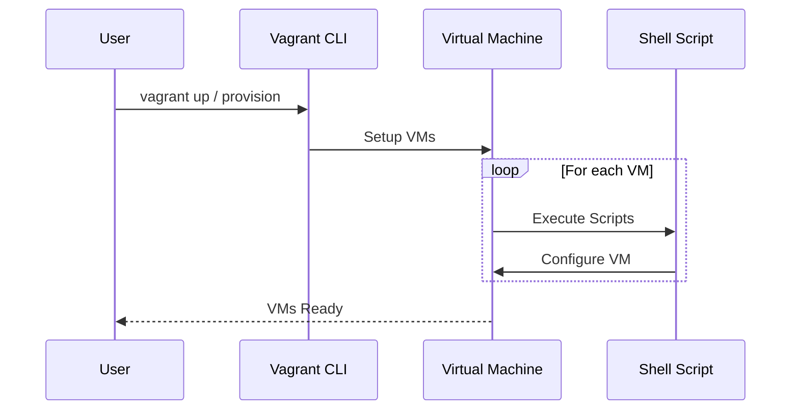
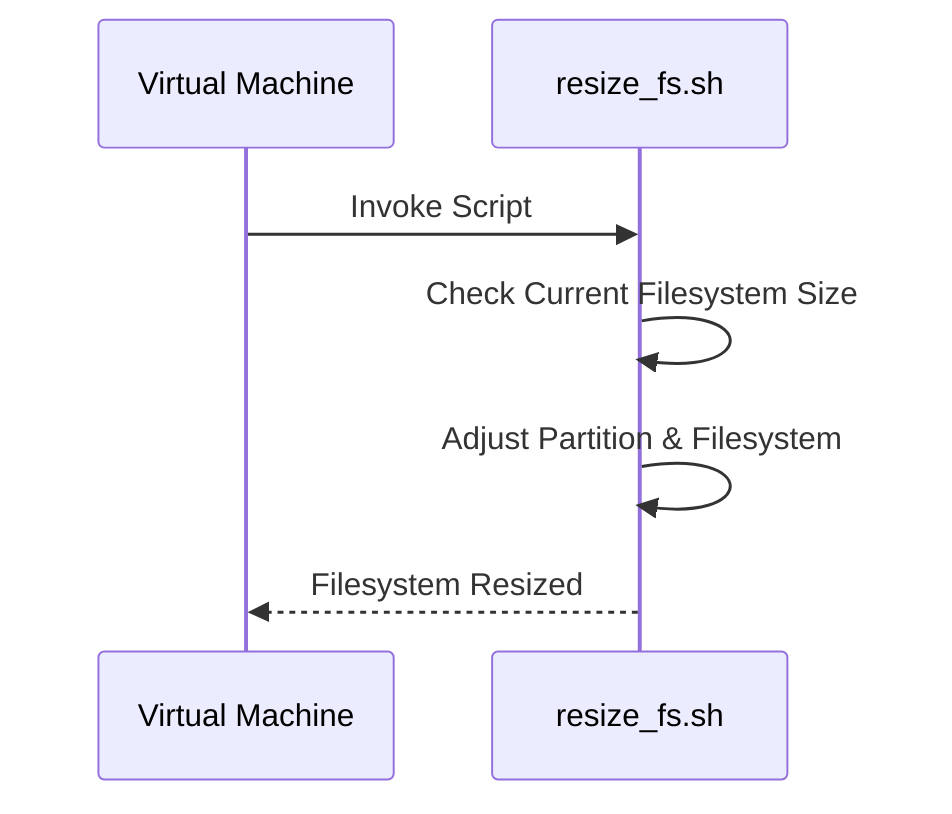
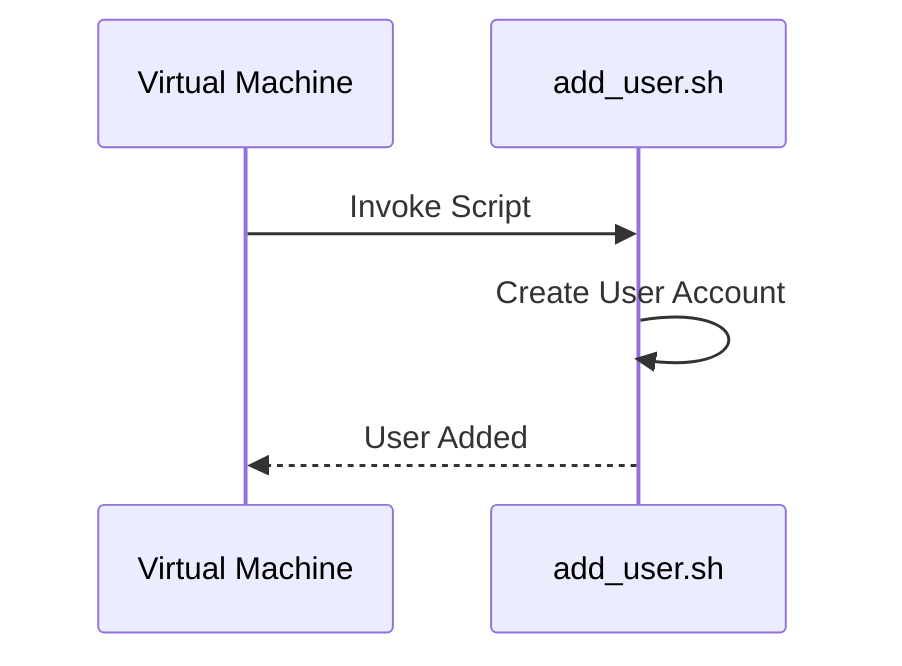
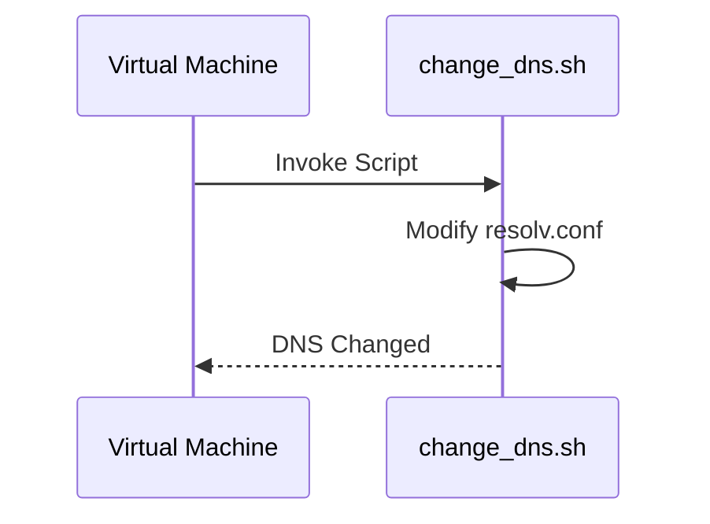
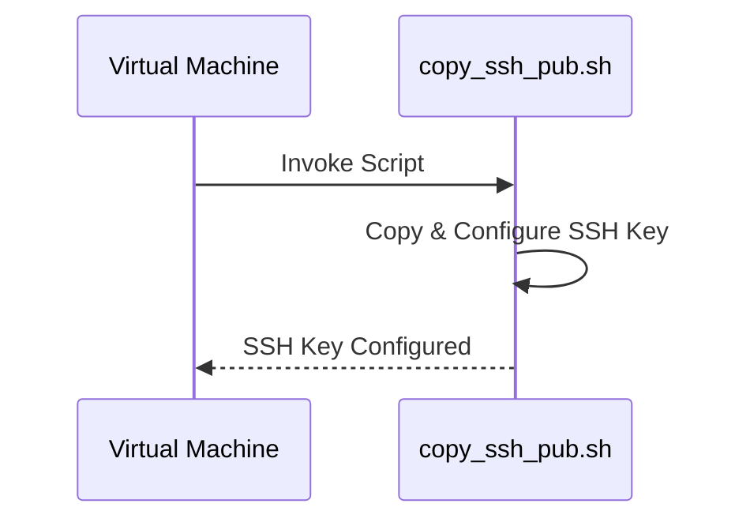

# Vagrant Environment Setup Documentation

This documentation outlines the setup of a local virtual machine (VM) environment using Vagrant, aimed at rapid deployment for labs, proof of concept projects, and potentially to create a local Kubernetes cluster. The setup is modular, allowing for easy expansion with additional servers and scripts.

## Configuration Overview

The environment is defined in `configuration.yaml`, specifying VM attributes such as host operating system, memory, CPUs, and IP addresses. Additionally, it manages SSH key distribution and custom shell scripts for tasks like resizing filesystems, adding users, changing DNS settings, and copying SSH public keys.

### YAML Configuration (`configuration.yaml`)

- **Vagrant API Version**: Defines the Vagrantfile API version.
- **Host OS**: Specifies the base OS for the VMs.
- **Default User**: Sets the username for the VM.
- **SSH Key Configuration**: Manages the copying of SSH public keys to VMs.
- **Servers Configuration**: Details the configuration for control plane and worker nodes, including resource allocation and networking.

### Shell Scripts

Custom shell scripts are utilized for various initialization and configuration tasks:

- **Resize Filesystem (`resize_fs.sh`)**: Adjusts the filesystem to match the new disk size.
- **Add Default User (`add_user.sh`)**: Creates a default user account.
- **Change DNS (`change_dns.sh`)**: Modifies the default DNS settings to improve resolution speed.
- **Copy SSH Public Key (`copy_ssh_pub.sh`)**: Facilitates SSH key distribution for secure access.

## Vagrantfile (`Vagrantfile`)

Defines the VMs' provisioning and configuration process, leveraging the `configuration.yaml` and executing shell scripts as per the setup requirements.

## Workflow Diagrams

### Vagrant Provisioning Process

### Shell Scripts Execution Flow

#### Resizing Filesystem

#### Adding Default User

#### Changing DNS Configuration

#### Copying SSH Public Key

## Conclusion

This modular and flexible Vagrant setup is designed for easy customization and expansion, making it suitable for a wide range of applications, from development labs to Kubernetes clusters. By utilizing Vagrant along with custom shell scripts, the environment can be quickly deployed and configured according to specific requirements, providing a robust solution for rapid prototyping and testing within a virtualized infrastructure.